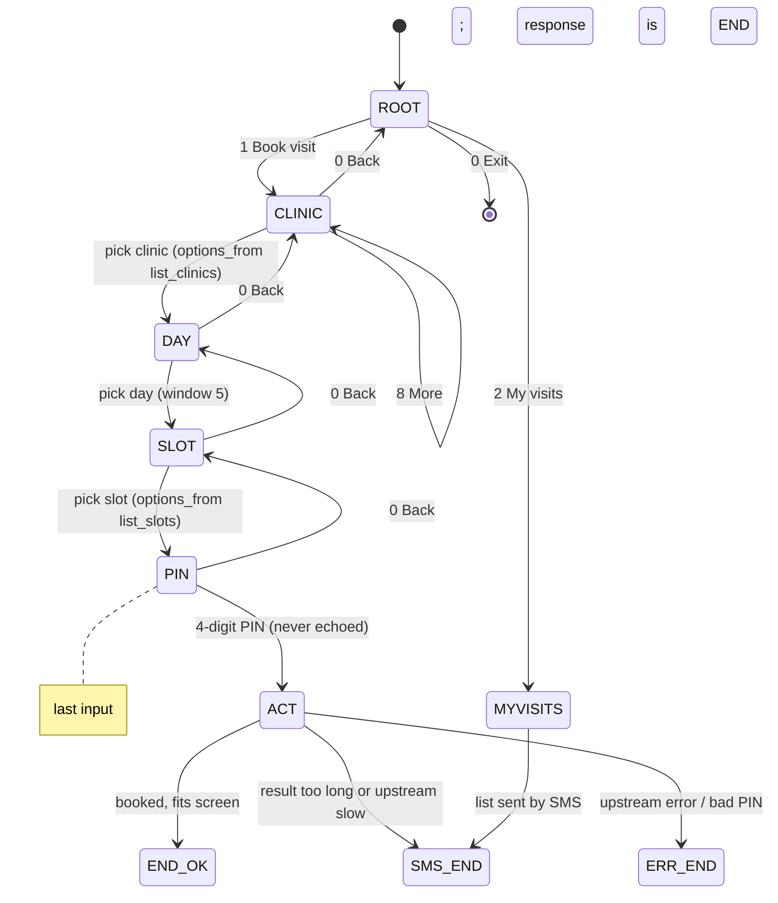
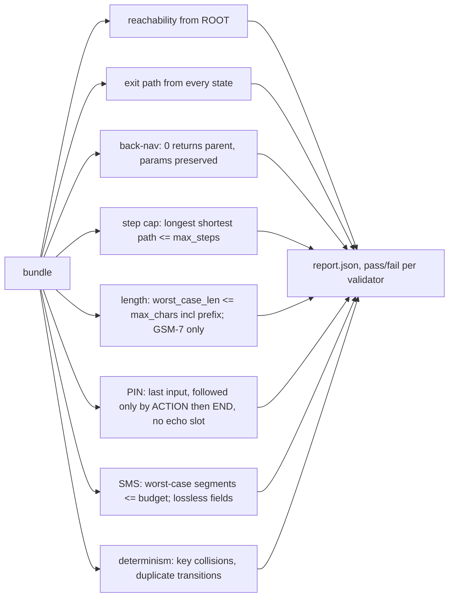
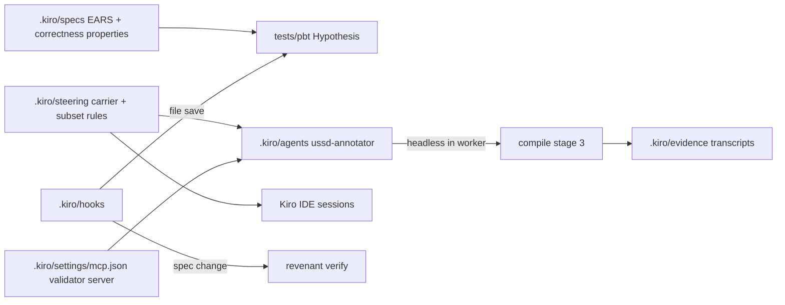
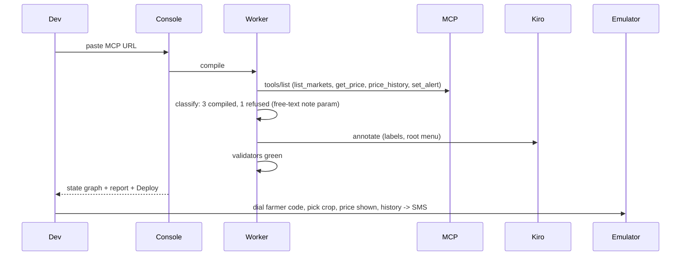

# Additional diagrams

## Clinic state machine (rendered subset)

```mermaid
stateDiagram-v2
  [*] --> ROOT
  ROOT --> CLINIC: 1 Book visit
  ROOT --> MYVISITS: 2 My visits
  ROOT --> [*]: 0 Exit
  CLINIC --> DAY: pick clinic (options_from list_clinics)
  CLINIC --> CLINIC: 8 More
  CLINIC --> ROOT: 0 Back
  DAY --> SLOT: pick day (window 5)
  DAY --> CLINIC: 0 Back
  SLOT --> PIN: pick slot (options_from list_slots)
  SLOT --> DAY: 0 Back
  PIN --> ACT: 4-digit PIN (never echoed)
  PIN --> SLOT: 0 Back
  ACT --> END_OK: booked, fits screen
  ACT --> SMS_END: result too long or upstream slow
  ACT --> ERR_END: upstream error / bad PIN
  MYVISITS --> SMS_END: list sent by SMS
  note right of PIN: last input; response is END
```

## Validator suite

```mermaid
flowchart LR
  B[bundle] --> V1[reachability from ROOT]
  B --> V2[exit path from every state]
  B --> V3[back-nav: 0 returns parent, params preserved]
  B --> V4[step cap: longest shortest path <= max_steps]
  B --> V5[length: worst_case_len <= max_chars incl prefix; GSM-7 only]
  B --> V6[PIN: last input, followed only by ACTION then END, no echo slot]
  B --> V7[SMS: worst-case segments <= budget; lossless fields]
  B --> V8[determinism: key collisions, duplicate transitions]
  V1 & V2 & V3 & V4 & V5 & V6 & V7 & V8 --> R[report.json, pass/fail per validator]
```

## Kiro touchpoints

```mermaid
flowchart LR
  Specs[.kiro/specs EARS + correctness properties] --> PBT[tests/pbt Hypothesis]
  Steering[.kiro/steering carrier + subset rules] --> Agent[.kiro/agents ussd-annotator]
  Steering --> IDE[Kiro IDE sessions]
  Hooks[.kiro/hooks] -->|file save| PBT
  Hooks -->|spec change| Verify[revenant verify]
  Agent -->|headless in worker| Compile[compile stage 3]
  MCP[.kiro/settings/mcp.json validator server] --> Agent
  Compile --> Evidence[.kiro/evidence transcripts]
```

## Demo data flow (farmer-prices live compile)

```mermaid
sequenceDiagram
  Dev->>Console: paste MCP URL
  Console->>Worker: compile
  Worker->>MCP: tools/list (list_markets, get_price, price_history, set_alert)
  Worker->>Worker: classify: 3 compiled, 1 refused (free-text note param)
  Worker->>Kiro: annotate (labels, root menu)
  Worker->>Worker: validators green
  Console-->>Dev: state graph + report + Deploy
  Dev->>Emulator: dial farmer code, pick crop, price shown, history -> SMS
```
